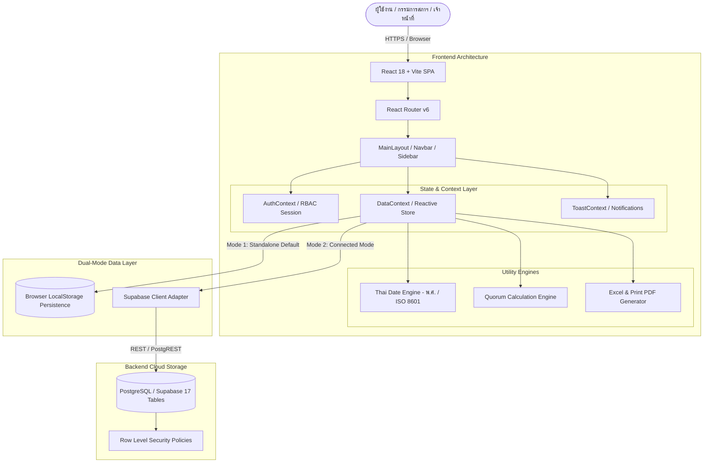
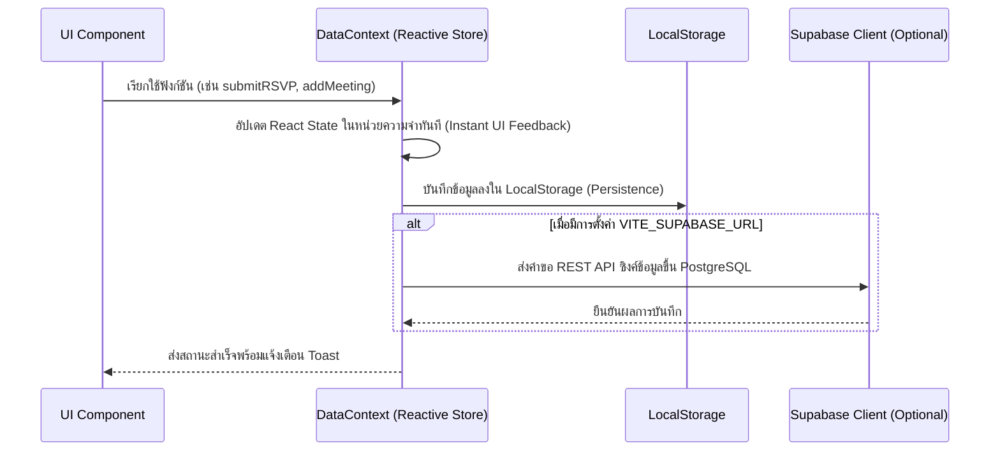

# เอกสารสถาปัตยกรรมระบบ (Architecture & Technical Design)

## ระบบ: MCU Council RSVP (ระบบตอบรับเข้าร่วมประชุมสภามหาวิทยาลัย มจร.)
**เอกสารเวอร์ชัน:** 1.0.0  
**สถานะ:** อนุมัติแล้ว (Approved)  

---

## 1. ภาพรวมสถาปัตยกรรมระบบ (System Overview)

MCU Council RSVP ถูกออกแบบตามสถาปัตยกรรม **Modern Single Page Application (SPA) with Dual-Mode Data Layer** โดยสามารถทำงานได้แบบสมบูรณ์ 100% ในโหมด Local Standalone (พร้อม Reactive Persistence) เพื่อความคล่องตัวในการทดสอบและตรวจรับงาน และสามารถสลับไปเชื่อมต่อฐานข้อมูลคลาวด์ **PostgreSQL / Supabase** ได้ทันทีเมื่อระบุ Environment Variables



---

## 2. ทางเลือกเทคโนโลยีและเหตุผลประกอบ (Tech Stack Decisions)

| ส่วนประกอบ | เทคโนโลยีที่เลือก | เหตุผลเชิงวิศวกรรม |
|---|---|---|
| **Frontend Framework** | React 18 + TypeScript | ความปลอดภัยทางด้านชนิดข้อมูล (Type Safety), การแยก UI Components เป็นโมดูลที่นำกลับมาใช้ซ้ำได้ง่าย |
| **Build Tool** | Vite 5 | ความเร็วสูงในการ Compile/Hot Module Replacement (HMR) และการสร้าง Production Bundle ขนาดเล็ก |
| **Styling & Theme** | Tailwind CSS | ความยืดหยุ่นสูงในการปรับแต่งโทนสีเอกลักษณ์ มจร. (ม่วง-ทอง) และการออกแบบที่ตอบสนองทุกขนาดหน้าจอ (Responsive) |
| **Icons** | Lucide React | ชุดไอคอนมาตรฐานสากล สวยงาม สม่ำเสมอ และโหลดแบบ Tree-shakable |
| **Routing** | React Router v6 | การจัดการเส้นทาง URL, Nested Layouts, และการเข้าถึงผ่านลิงก์เฉพาะบุคคล `/rsvp/:token` |
| **Form Validation** | Zod + React Hook Form | การตรวจสอบความถูกต้องของข้อมูล (เช่น วันปิดรับต้องก่อนวันประชุม) แบบ Declarative ที่แม่นยำ |
| **Data Visualization** | Recharts | การเรนเดอร์กราฟสถิติการตอบรับ (Donut/Bar Chart) แบบ Responsive และ Interactive |
| **Spreadsheet & PDF** | SheetJS (`xlsx`) + CSS Print | การสร้างและส่งออกไฟล์ Excel และการพิมพ์รายงานทางการที่มีความเข้ากันได้สูงโดยไม่ต้องพึ่งพาเซิร์ฟเวอร์ภายนอก |
| **QR Code Engine** | `qrcode.react` | การสร้าง QR Code ชนิด SVG สำหรับบัตรเช็กชื่อหน้างานที่คมชัดและปลอดภัย |
| **Database & Auth** | Supabase (PostgreSQL 15+) | รองรับ Relational Schema 17 ตาราง, JSONB สำหรับ Settings, และ Row Level Security (RLS) |

---

## 3. สถาปัตยกรรมการจัดการข้อมูลสองโหมด (Dual-Mode Data Architecture)

เพื่อตอบสนองต่อเงื่อนไขการทดสอบระบบที่ห้ามล็อกข้อมูล และต้องสามารถทดสอบในเครื่องได้ทันที ระบบจึงสร้างเลเยอร์ Data Access แบบ Dual-Mode:



- **Standalone Mode (ค่าเริ่มต้น)**: ข้อมูลเริ่มต้นถูกโหลดจาก `src/data/seedData.ts` และบันทึกลงใน `localStorage` ด้วยคีย์นำหน้า `mcu_council_*` ทุกการสร้าง แก้ไข ลบ หรือคัดลอก จะถูกบันทึกคงอยู่แม้รีเฟรชเบราว์เซอร์ และมีปุ่ม **Reset Seed** ให้คืนค่าได้เสมอ
- **Cloud Mode**: หากผู้ใช้กำหนด `VITE_SUPABASE_URL` และ `VITE_SUPABASE_ANON_KEY` ในไฟล์ `.env` ระบบสามารถต่อเชื่อมกับสคีมา SQL ในโฟลเดอร์ `supabase/schema.sql` ได้ทันที

---

## 4. เครื่องยนต์ประมวลผลวันและเวลาไทย (Thai Buddhist Era Engine)

ข้อกำหนดสำคัญของระบบ มจร. คือการจัดเก็บข้อมูลตามมาตรฐานสากล แต่ต้องแสดงผลตามขนบปฏิทินไทยและปี พ.ศ. ระบบจึงสร้างโมดูล `src/utils/thaiDate.ts` ซึ่งทำหน้าที่เป็น Data Transformer กลาง:

```
[ฐานข้อมูล / State]                         [หน้าจอแสดงผล / รายงาน]
ISO 8601 String                       Thai Buddhist Representation
"2026-09-24T09:30:00Z"   <========>   "๒๔ กันยายน ๒๕๖๙ เวลา ๐๙:๓๐ น."
"2026-10-18"             <========>   "18 ต.ค. 2569" (อีก 3 วัน)
```

### ฟังก์ชันสำคัญ:
- `toBuddhistYear(year: number)`: คำนวณปี พ.ศ. โดยบวก 543 จากปี ค.ศ.
- `toGregorianYear(beYear: number)`: คำนวณปี ค.ศ. สำหรับจัดเก็บลงฐานข้อมูล
- `formatThaiDate(date, options)`: จัดรูปแบบวันที่ทางการ เช่น *"วันพฤหัสบดีที่ ๒๔ กันยายน ๒๕๖๙"* หรือ *"24 กันยายน 2569"*
- `formatThaiTime(time)`: จัดรูปแบบเวลาตามระเบียบสารบรรณ เช่น *"09:30 น."*
- `getThaiRelativeTime(date)`: คำนวณเวลาสัมพัทธ์ เช่น *"อีก 3 วัน"*, *"เมื่อวานนี้"*, *"เลยกำหนดแล้ว"*
- `getBuddhistYearOptions()`: สร้างชุดตัวเลือกปี พ.ศ. ย้อนหลัง 3 ปี และล่วงหน้า 3 ปี

---

## 5. สถาปัตยกรรมความปลอดภัยและการควบคุมสิทธิ์ (Security & RBAC Architecture)

### 5.1 ผังเมทริกซ์สิทธิ์การใช้งาน (Role-Permission Matrix)

| สิทธิ์การใช้งาน (Permissions) | `super_admin` | `staff` | `secretary` | `chairperson` | `member` | `delegate` |
|---|:---:|:---:|:---:|:---:|:---:|:---:|
| ดูแดชบอร์ดภาพรวมสภาฯ | ✅ | ✅ | ✅ | ✅ | ❌ | ❌ |
| สร้าง/แก้ไข/คัดลอกการประชุม | ✅ | ✅ | ❌ | ❌ | ❌ | ❌ |
| เปิด/ปิดรับตอบรับการประชุม | ✅ | ✅ | ✅ | ❌ | ❌ | ❌ |
| จัดการฐานข้อมูลสมาชิกสภาฯ | ✅ | ✅ | ❌ | ❌ | ❌ | ❌ |
| นำเข้า/ส่งออกข้อมูลกรรมการ | ✅ | ✅ | ❌ | ❌ | ❌ | ❌ |
| พิจารณาอนุมัติคำขอลา/ผู้แทน | ✅ | ❌ | ✅ | ❌ | ❌ | ❌ |
| กำหนดสิทธิ์องค์ประชุมของผู้แทน | ✅ | ❌ | ✅ | ❌ | ❌ | ❌ |
| เช็กชื่อผู้เข้าร่วมประชุมวันงาน | ✅ | ✅ | ✅ | ❌ | ❌ | ❌ |
| รับรองผลองค์ประชุม (Certify Quorum) | ✅ | ❌ | ✅ | ❌ | ❌ | ❌ |
| ดูรายงานและพิมพ์รายงาน 10 รูปแบบ | ✅ | ✅ | ✅ | ✅ | ❌ | ❌ |
| ตั้งค่าระบบส่วนกลาง/Audit Log | ✅ | ❌ | ❌ | ❌ | ❌ | ❌ |
| ตอบรับการประชุม/ขอลา/มอบหมาย | ❌ | ❌ | ❌ | ❌ | ✅ | ❌ |
| แก้ไขเบอร์โทร/อีเมลของตนเอง | ❌ | ❌ | ❌ | ❌ | ✅ | ❌ |
| ดูรายละเอียดงานที่ได้รับมอบหมาย | ❌ | ❌ | ❌ | ❌ | ❌ | ✅ |

### 5.2 กลไกความปลอดภัยของลิงก์ตอบรับเฉพาะบุคคล (Tokenized RSVP Security)
- ลิงก์ตอบรับสำหรับกรรมการแต่ละท่านใช้โทเคนสุ่มความยาวสูง (`tok_[meeting_id]_[profile_id]_[entropy]`) ที่คาดเดาไม่ได้ (Unguessable)
- โทเคนมีวันหมดอายุตามที่กำหนดไว้ใน System Settings (ค่าเริ่มต้น 14 วัน)
- สามารถเพิกถอนสิทธิ์โทเคนได้ทันทีหากมีการเปลี่ยนแปลงรายชื่อ
- **การปฏิบัติตาม PDPA**: ข้อมูลที่ส่งผ่าน QR Code สำหรับเช็กชื่อ จะบรรจุเฉพาะรหัสอ้างอิงคลุมเครือ (Opaque Reference: `MCU-RSVP:REF:ID`) โดยไม่มีการใส่ชื่อ นามสกุล หรือข้อมูลส่วนบุคคลลงในภาพ QR Code เพื่อป้องกันการแอบอ่านข้อมูล

---

## 6. เครื่องยนต์คำนวณและรับรององค์ประชุม (Quorum Engine Architecture)

เครื่องยนต์คำนวณองค์ประชุมทำงานแบบเรียลไทม์ โดยแยกมิติของ **"สิทธิ์"** ออกจาก **"การเข้าประชุมจริง"**:

```
[ผู้เข้าร่วมประชุมจริงที่นับองค์ได้] = 
  SUM(กรรมการที่เช็กชื่อแล้ว และ HasQuorumRights = true) +
  SUM(ผู้แทนที่เช็กชื่อแล้ว และ ได้รับการอนุมัติสิทธิ์ CanCountAsQuorum = true)
```

```mermaid
flowchart TD
    Start[เริ่มการคำนวณองค์ประชุม] --> GetEligible[นับจำนวนกรรมการผู้มีสิทธิ์นับองค์ทั้งหมด: TotalEligible]
    GetEligible --> GetAttended[นับจำนวนผู้เช็กชื่อจริงที่ยังไม่ออก: QuorumAttendedCount]
    
    GetAttended --> CheckRule{ตรวจสอบกฎองค์ประชุม}
    CheckRule -->|มากกว่ากึ่งหนึ่ง| R1[MinimumRequired = Floor(TotalEligible / 2) + 1]
    CheckRule -->|ไม่น้อยกว่ากึ่งหนึ่ง| R2[MinimumRequired = Ceil(TotalEligible / 2)]
    CheckRule -->|กำหนดจำนวนเอง| R3[MinimumRequired = CustomThreshold]
    
    R1 --> CheckCount{QuorumAttendedCount >= MinimumRequired?}
    R2 --> CheckCount
    R3 --> CheckCount
    
    CheckCount -->|ไม่ผ่าน| Incomplete[สถานะ: ยังไม่ครบองค์ประชุม]
    CheckCount -->|ผ่าน| CheckChair{ต้องมีนายกสภาฯ / ผู้แทนประธาน?}
    
    CheckChair -->|ใช่ แต่ประธานยังไม่มา| Incomplete
    CheckChair -->|ใช่ และประธานมาแล้ว หรือ ไม่บังคับ| Complete[สถานะ: ครบองค์ประชุมแล้ว]
    
    Complete --> SecretaryCertify[เลขานุการสภาฯ กดรับรององค์ประชุม]
    SecretaryCertify --> Log[บันทึกลง QuorumLog พร้อมเวลาและชื่อผู้รับรอง]
```

### กฎสำคัญด้านธุรกิจ (Business Invariants):
1. **ห้ามนับผู้แทนเป็นองค์ประชุมโดยอัตโนมัติ**: ค่าเริ่มต้นของ `canCountAsQuorum` ในตาราง `delegate_requests` ต้องเป็น `false` เสมอ และจะเปลี่ยนเป็น `true` ได้ก็ต่อเมื่อเลขานุการสภาฯ ติ๊กเลือกอนุมัติสิทธิ์ในหน้า `/approvals` เท่านั้น
2. **การเช็กเอาท์ (Check-out)**: หากกรรมการออกจากห้องประชุมก่อนเวลา และเจ้าหน้าที่บันทึกเช็กเอาท์ ตัวนับองค์ประชุมจะลดลงทันทีแบบไดนามิก

---

## 7. สถาปัตยกรรมการออกรายงานและการพิมพ์ (Report & Export Engine)

ระบบรายงานถูกออกแบบให้รองรับการออกเอกสารได้ 2 รูปแบบหลัก โดยไม่ต้องประมวลผลบนเซิร์ฟเวอร์:
1. **การส่งออก Excel (.xlsx)**:
   - ใช้ไลบรารี `xlsx` (SheetJS) แปลงข้อมูล Object ในหน่วยความจำเป็น Worksheet และ Workbook
   - ตั้งชื่อไฟล์ตามมาตรฐาน มจร. เช่น `MCU_Report_rsvp_summary.xlsx`
2. **การพิมพ์ออกทางเครื่องพิมพ์ / PDF (Print-to-PDF)**:
   - ออกแบบชุดสไตล์ `@media print` ในไฟล์ `src/index.css`
   - ซ่อนแถบ Navbar, Sidebar, และปุ่มกดต่าง ๆ เมื่อสั่งพิมพ์
   - แสดงตราสัญลักษณ์ มจร. ส่วนหัวเอกสารสารบรรณ และช่องลงนามของเจ้าหน้าที่ผู้จัดทำและเลขานุการสภาฯ อย่างถูกต้องตามระเบียบงานสารบรรณ
