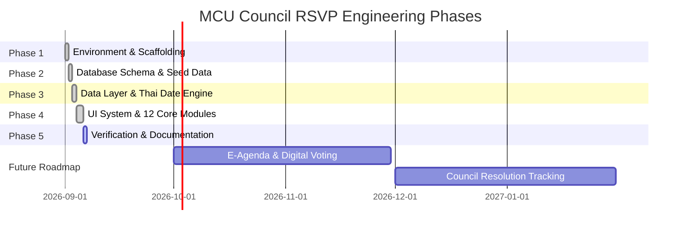

# แผนงานเชิงวิศวกรรมและการพัฒนาระบบ (Implementation Plan & Engineering Roadmap)

## โครงการ: MCU Council RSVP (ระบบตอบรับเข้าร่วมประชุมสภามหาวิทยาลัย)
**หน่วยงาน:** สำนักงานสภามหาวิทยาลัย มหาวิทยาลัยมหาจุฬาลงกรณราชวิทยาลัย (มจร.)  
**เอกสารเวอร์ชัน:** 1.0.0  

---

## 1. ลำดับขั้นตอนการพัฒนา (Development & Engineering Phases)



### เฟสที่ 1: การจัดเตรียมสภาพแวดล้อมและ Scaffolding (เสร็จสมบูรณ์)
- สร้างโปรเจกต์ด้วย Vite + React 18 + TypeScript
- ติดตั้งและกำหนดค่า Tailwind CSS พร้อม Palette สีประจำสถาบัน มจร. (Primary: `#4B1F5E`, Secondary: `#6B3F83`, Gold: `#C8A54B`)
- กำหนดค่า Type Checking และ Module Bundling ใน `tsconfig.json` และ `vite.config.ts`

### เฟสที่ 2: การออกแบบฐานข้อมูลและข้อมูลตัวอย่างสมมุติ (เสร็จสมบูรณ์)
- พัฒนาโครงสร้างฐานข้อมูล PostgreSQL/Supabase 17 ตารางใน `supabase/schema.sql` พร้อมกำหนด Row-Level Security (RLS) และ Indexes
- ออกแบบข้อมูลตัวอย่างสมมุติภาษาไทยตามบริบทมหาวิทยาลัยสงฆ์ (มจร.) ใน `supabase/seed.sql` และ `src/data/seedData.ts` (พระเถระ, ผู้บริหาร, ผู้ทรงคุณวุฒิ) โดยไม่มีการใช้ข้อมูลส่วนบุคคลจริง

### เฟสที่ 3: สถาปัตยกรรมข้อมูลสองโหมดและเครื่องยนต์ปฏิทินไทย (เสร็จสมบูรณ์)
- พัฒนา `src/utils/thaiDate.ts` เพื่อแปลงข้อมูล ISO 8601 ให้แสดงผลเป็นปฏิทินไทยและปี พ.ศ. พร้อมคำนวณเวลาสัมพัทธ์
- พัฒนา `AuthContext.tsx` สำหรับจำลองและจัดการ Role-based Access Control 6 บทบาท พร้อม Quick Role Switcher
- พัฒนา `DataContext.tsx` ในรูปแบบ Reactive Store มีความคงทนผ่าน Browser LocalStorage พร้อมทั้งรองรับ Supabase Client Adapter

### เฟสที่ 4: การพัฒนาส่วนประกอบ UI และโมดูลทั้ง 12 หน้าจอ (เสร็จสมบูรณ์)
1. **Login Page (`/login`)**: รองรับ MCU SSO, บัญชีผู้ใช้, และ Quick Login
2. **Dashboard (`/`)**: สรุป 6 KPI Cards, กราฟ Recharts, ตารางประชุมใกล้มาถึง
3. **Meeting List (`/meetings`)**: กรองปี พ.ศ., เดือน, รูปแบบ, คัดลอกการประชุม, Pagination
4. **Meeting Wizard (`/meetings/create`, `/edit`)**: ฟอร์ม 3 ขั้นตอน, Validation วันปิดรับต้องก่อนวันประชุม, สถานที่เริ่มต้นห้อง 401 มจร., Live Preview
5. **Meeting Detail (`/meetings/:id`)**: ข้อมูลสมบูรณ์, สรุป 5 มิติ, เอกสารแนบ, Activity Log
6. **Member RSVP (`/rsvp/:token`)**: หน้าตอบรับเฉพาะบุคคล, Radio Cards, แนบหนังสือมอบหมาย, QR Code เช็กชื่อ, PDPA
7. **Responses (`/responses`)**: การ์ดสรุป 7 สถานะ, กราฟแท่ง, ส่งเตือนผู้ยังไม่ตอบรับ, ส่งออก Excel และ PDF
8. **Approvals (`/approvals`)**: ตรวจสอบผู้แทน/คำขอลา, บังคับเหตุผลเมื่อไม่อนุมัติ, กำหนดสิทธิ์องค์ประชุมของผู้แทน
9. **Members Directory (`/members`)**: ฐานข้อมูลสมาชิก, เตือนใกล้ครบวาระ, นำเข้า Excel พร้อม Preview Modal, ส่งออก Excel
10. **Attendance & Quorum (`/attendance`)**: แบนเนอร์สถานะ "ครบ/ไม่ครบองค์ประชุม", สแกน QR Code จำลอง, เช็กชื่อ Onsite/Online, เลขาฯ กดรับรอง
11. **Reports (`/reports`)**: รายงานทางการ 10 รูปแบบ, Interactive Preview, ส่งออก Excel และ Print/PDF
12. **Settings (`/settings`)**: ตั้งค่าสถานที่ห้อง 401, เทมเพลต, สิทธิ์ RBAC, Audit Log, Reset Seed
13. **Member Pages**: `/my-meetings`, `/history`, `/profile`, `/notifications`, `/invitees`

### เฟสที่ 5: การตรวจสอบคุณภาพและเอกสารระบบ (กำลังดำเนินการ)
- ตรวจสอบ Type Checking (`tsc`) และ Production Build (`vite build`) ผ่านสมบูรณ์ 100% ปราศจาก Error
- จัดทำชุดเอกสาร Documentation Memory 6 ไฟล์ฉบับสมบูรณ์

---

## 2. มาตรฐานการพัฒนาและการเขียนโค้ด (Coding & Engineering Standards)

### 2.1 โครงสร้างโฟลเดอร์ที่เป็นระเบียบ (Folder Structure)
```
src/
├── components/      # UI Components แยกเป็น layout และ atomic ui
│   ├── layout/      # Navbar, Sidebar, MainLayout
│   └── ui/          # StatusBadge, Modal, ToastNotification, States
├── context/         # React Contexts (AuthContext, DataContext)
├── data/            # Mock Seed Data ภาษาไทย
├── pages/           # 12+ Feature Screens
├── types/           # TypeScript Definitions
└── utils/           # Helper functions (thaiDate, formatting)
```

### 2.2 กฎความปลอดภัยทางด้านข้อมูล (Data Integrity Rules)
1. **วันและเวลา**: จัดเก็บเป็น ISO 8601 String เสมอ (`YYYY-MM-DD` หรือ `YYYY-MM-DDTHH:mm:ssZ`) ห้ามเก็บปี พ.ศ. ลงฐานข้อมูลโดยตรง การแปลงเป็น พ.ศ. ต้องทำผ่าน `thaiDate.ts` เสมอ
2. **สิทธิ์องค์ประชุมของผู้แทน**: ต้องคงค่าเริ่มต้น `canCountAsQuorum: false` เสมอในทุกจุด ห้ามเปลี่ยนเป็น true โดยอัตโนมัติ ต้องกระทำผ่านฟังก์ชัน `reviewDelegateRequest` ที่มีผู้มีอำนาจ (Secretary) พิจารณาเท่านั้น
3. **การตรวจสอบความถูกต้องของแบบฟอร์ม**:
   - วันและเวลาปิดรับตอบรับ (RSVP Deadline) ต้องตรวจสอบว่าเกิดขึ้นก่อนวันและเวลาเริ่มการประชุมเสมอ
   - หากเลือกไม่อนุมัติคำขอลาหรือผู้แทน ต้องบังคับกรอกหมายเหตุเหตุผลเสมอ

---

## 3. แนวทางการต่อขยายระบบในอนาคต (Extensibility Guide)

### 3.1 การเพิ่มชุดคณะกรรมการใหม่ (Adding a New Committee)
1. เพิ่มข้อมูลในตาราง `committees` ผ่าน `src/data/seedData.ts` หรือ `INSERT INTO committees` ใน SQL
2. ระบุกติกาองค์ประชุมเริ่มต้น (`default_quorum_rule`) เช่น `more_than_half` หรือ `not_less_than_half`
3. ระบบในหน้าสร้างการประชุมจะดึงคณะกรรมการใหม่มาแสดงใน Dropdown อัตโนมัติ

### 3.2 การเพิ่มรูปแบบรายงานใหม่ (Adding a New Report Template)
1. เปิดไฟล์ `src/pages/ReportsPage.tsx`
2. เพิ่มรายการในอาร์เรย์ `reportOptions` พร้อมรหัส `id` และคำอธิบาย
3. เพิ่มเงื่อนไข `case` ใน `reportData` และ `tableHeaders` เพื่อดึงและจัดเรียงข้อมูลตามฟิลด์ที่ต้องการ
4. ระบบ Preview และ Export Excel/PDF จะรองรับรายงานใหม่ทันทีโดยอัตโนมัติ

### 3.3 การเชื่อมต่อกับฐานข้อมูล Supabase บน Production (Cloud Migration)
1. สร้างโปรเจกต์ใหม่ใน [Supabase Console](https://app.supabase.com)
2. เปิด SQL Editor ใน Supabase แล้วรันคำสั่งจาก `supabase/schema.sql` ตามด้วย `supabase/seed.sql`
3. คัดลอก Project URL และ Anon Key มาใส่ในไฟล์ `.env`:
   ```env
   VITE_SUPABASE_URL=https://your-project.supabase.co
   VITE_SUPABASE_ANON_KEY=your-anon-key-here
   ```
4. ระบบจะเชื่อมต่อกับฐานข้อมูลคลาวด์โดยตรง
