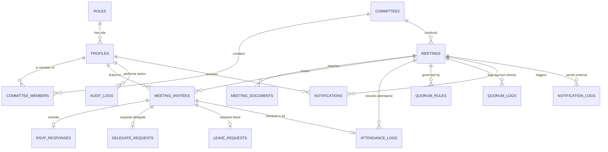

# เอกสารพจนานุกรมข้อมูลและสคีมาฐานข้อมูล (Database Schema & Data Dictionary)

## ระบบ: MCU Council RSVP (ระบบตอบรับเข้าร่วมประชุมสภามหาวิทยาลัย มจร.)
**เครื่องมือฐานข้อมูล:** PostgreSQL 15+ / Supabase  
**เอกสารเวอร์ชัน:** 1.0.0  
**ไฟล์สคริปต์ SQL ที่เกี่ยวข้อง:** `supabase/schema.sql` และ `supabase/seed.sql`  

---

## 1. แผนภาพความสัมพันธ์ของเอนทิตี (Entity-Relationship Diagram: ERD)

---

## 2. พจนานุกรมข้อมูลอย่างละเอียด (Data Dictionary: 17 Tables)

### 2.1 ตาราง `roles` (บทบาทผู้ใช้งานในระบบ)
ใช้กำหนดระดับสิทธิ์การเข้าถึงและการดำเนินงานในระบบ 6 บทบาท

| ชื่อคอลัมน์ | ชนิดข้อมูล | Nullable | ค่าเริ่มต้น | ความหมายและคำอธิบาย |
|---|---|---|---|---|
| `id` | VARCHAR(50) | NO | - | **Primary Key**: รหัสบทบาท (`super_admin`, `staff`, `secretary`, `chairperson`, `member`, `delegate`) |
| `name_th` | VARCHAR(100) | NO | - | ชื่อบทบาทภาษาไทย เช่น "ผู้ดูแลระบบสูงสุด", "เจ้าหน้าที่สำนักงานสภาฯ" |
| `name_en` | VARCHAR(100) | NO | - | ชื่อบทบาทภาษาอังกฤษ เช่น "Super Administrator", "Staff Officer" |
| `description` | TEXT | YES | NULL | รายละเอียดคำอธิบายหน้าที่และขอบเขตอำนาจ |
| `created_at` | TIMESTAMPTZ | YES | NOW() | วันเวลาที่สร้างระเบียนข้อมูล (ISO 8601) |
| `updated_at` | TIMESTAMPTZ | YES | NOW() | วันเวลาที่แก้ไขล่าสุด (ISO 8601) |

---

### 2.2 ตาราง `profiles` (ข้อมูลบัญชีผู้ใช้งาน)
เก็บบัญชีผู้ใช้ ข้อมูลสมณศักดิ์ คำนำหน้า และข้อมูลติดต่อของบุคลากร มจร. และกรรมการสภาฯ

| ชื่อคอลัมน์ | ชนิดข้อมูล | Nullable | ค่าเริ่มต้น | ความหมายและคำอธิบาย |
|---|---|---|---|---|
| `id` | UUID | NO | uuid_generate_v4() | **Primary Key**: รหัสประจำตัวผู้ใช้ |
| `email` | VARCHAR(255) | NO | - | **Unique**: อีเมลสำหรับเข้าสู่ระบบและรับเอกสาร |
| `title` | VARCHAR(50) | YES | NULL | สมณศักดิ์ หรือ คำนำหน้าชื่อ เช่น พระธรรมวชิรคุณาธาร, ศ.พิเศษ ดร., นาย |
| `first_name` | VARCHAR(100) | NO | - | ชื่อจริง (หรือชื่อสมณศักดิ์) |
| `last_name` | VARCHAR(100) | NO | - | นามสกุล หรือ ฉายาทางศาสนา |
| `phone` | VARCHAR(50) | YES | NULL | หมายเลขโทรศัพท์มือถือสำหรับติดต่อเร่งด่วน |
| `organization` | VARCHAR(255) | YES | NULL | ส่วนงาน คณะ หรือวิทยาเขตใน มจร. หรือหน่วยงานภายนอก |
| `position` | VARCHAR(255) | YES | NULL | ตำแหน่งงาน เช่น คณบดี, รองอธิการบดี, กรรมการผู้ทรงคุณวุฒิ |
| `avatar_url` | TEXT | YES | NULL | ลิงก์รูปภาพประจำตัว |
| `role_id` | VARCHAR(50) | YES | 'member' | **Foreign Key** อ้างอิง `roles(id)` |
| `is_active` | BOOLEAN | YES | TRUE | สถานะการเปิดใช้งานบัญชี |
| `last_login_at`| TIMESTAMPTZ | YES | NULL | วันเวลาที่เข้าสู่ระบบครั้งล่าสุด |
| `created_at` | TIMESTAMPTZ | YES | NOW() | วันเวลาที่สร้างระเบียน (ISO 8601) |
| `updated_at` | TIMESTAMPTZ | YES | NOW() | วันเวลาที่ปรับปรุงล่าสุด (ISO 8601) |

---

### 2.3 ตาราง `committees` (คณะกรรมการชุดต่าง ๆ)
ชุดคณะกรรมการในกำกับของสำนักงานสภามหาวิทยาลัย

| ชื่อคอลัมน์ | ชนิดข้อมูล | Nullable | ค่าเริ่มต้น | ความหมายและคำอธิบาย |
|---|---|---|---|---|
| `id` | UUID | NO | uuid_generate_v4() | **Primary Key**: รหัสคณะกรรมการ |
| `code` | VARCHAR(50) | NO | - | **Unique**: รหัสย่อ เช่น `MCU-COUNCIL`, `MCU-ADMIN` |
| `name_th` | VARCHAR(255) | NO | - | ชื่อคณะกรรมการภาษาไทย |
| `name_en` | VARCHAR(255) | YES | NULL | ชื่อคณะกรรมการภาษาอังกฤษ |
| `description` | TEXT | YES | NULL | คำอธิบายอำนาจหน้าที่ตามข้อบังคับมหาวิทยาลัย |
| `default_quorum_rule` | VARCHAR(50) | YES | 'more_than_half' | กฎองค์ประชุมเริ่มต้น (`more_than_half`, `not_less_than_half`, `custom_count`) |
| `default_quorum_custom_count` | INT | YES | 0 | จำนวนขั้นต่ำเริ่มต้นหากใช้กติกา custom_count |
| `is_active` | BOOLEAN | YES | TRUE | สถานะคณะกรรมการ |
| `created_at` | TIMESTAMPTZ | YES | NOW() | วันเวลาที่สร้าง (ISO 8601) |
| `updated_at` | TIMESTAMPTZ | YES | NOW() | วันเวลาที่แก้ไข (ISO 8601) |

---

### 2.4 ตาราง `committee_members` (สมาชิกในคณะกรรมการ)
เชื่อมโยงกรรมการเข้ากับชุดคณะกรรมการ พร้อมบันทึกวาระและสิทธิ์

| ชื่อคอลัมน์ | ชนิดข้อมูล | Nullable | ค่าเริ่มต้น | ความหมายและคำอธิบาย |
|---|---|---|---|---|
| `id` | UUID | NO | uuid_generate_v4() | **Primary Key**: รหัสระเบียนสมาชิกภาพ |
| `committee_id` | UUID | NO | - | **Foreign Key** อ้างอิง `committees(id)` |
| `profile_id` | UUID | NO | - | **Foreign Key** อ้างอิง `profiles(id)` |
| `member_code` | VARCHAR(50) | YES | NULL | รหัสประจำตัวกรรมการ เช่น `MCU-M-001` |
| `committee_role` | VARCHAR(100) | NO | - | ตำแหน่งในสภาฯ เช่น นายกสภาฯ, อธิการบดี, กรรมการผู้ทรงคุณวุฒิ, เลขานุการ |
| `has_quorum_rights` | BOOLEAN | YES | TRUE | **สิทธิ์นับองค์ประชุม** (True = มีสิทธิ์นับในเกณฑ์) |
| `has_voting_rights` | BOOLEAN | YES | TRUE | **สิทธิ์ออกเสียงลงมติ** |
| `term_start_date` | DATE | YES | NULL | วันที่เริ่มต้นวาระการดำรงตำแหน่ง |
| `term_end_date` | DATE | YES | NULL | วันที่สิ้นสุดวาระการดำรงตำแหน่ง (ใช้คำนวณการแจ้งเตือนใกล้หมดวาระ) |
| `is_active` | BOOLEAN | YES | TRUE | สถานะการดำรงตำแหน่งในปัจจุบัน |
| `notes` | TEXT | YES | NULL | บันทึกเพิ่มเติม เช่น พระบรมราชโองการโปรดเกล้าฯ แต่งตั้ง |
| `created_at` | TIMESTAMPTZ | YES | NOW() | วันเวลาที่สร้าง (ISO 8601) |
| `updated_at` | TIMESTAMPTZ | YES | NOW() | วันเวลาที่แก้ไข (ISO 8601) |

---

### 2.5 ตาราง `meetings` (รายการประชุม)
ข้อมูลรายการประชุม วัน เวลา รูปแบบ สถานที่ และช่องทางออนไลน์

| ชื่อคอลัมน์ | ชนิดข้อมูล | Nullable | ค่าเริ่มต้น | ความหมายและคำอธิบาย |
|---|---|---|---|---|
| `id` | UUID | NO | uuid_generate_v4() | **Primary Key**: รหัสการประชุม |
| `committee_id` | UUID | NO | - | **Foreign Key** อ้างอิง `committees(id)` |
| `title` | VARCHAR(255) | NO | - | ชื่อการประชุมทางการ |
| `meeting_number`| VARCHAR(50) | NO | - | ครั้งที่ประชุม เช่น "1/2569", "8/2569" |
| `beYear` / `be_year` | INT | NO | - | ปี พ.ศ. เช่น 2569 |
| `meeting_type` | VARCHAR(50) | NO | 'regular' | ประเภทการประชุม: `regular` (ปกติ), `special` (พิเศษ), `urgent` (เร่งด่วน) |
| `meeting_format`| VARCHAR(50) | NO | 'Hybrid' | รูปแบบการจัดประชุม: `Onsite`, `Online`, `Hybrid` |
| `meeting_date` | DATE | NO | - | วันที่จัดการประชุม (ISO Date YYYY-MM-DD) |
| `start_time` | TIME | NO | - | เวลาเริ่มต้นการประชุม เช่น "09:30:00" |
| `end_time` | TIME | NO | - | เวลาสิ้นสุดการประชุมโดยประมาณ เช่น "16:30:00" |
| `rsvp_open_at` | TIMESTAMPTZ | NO | - | วันและเวลาที่เริ่มเปิดรับการตอบรับ (ISO 8601) |
| `rsvp_deadline`| TIMESTAMPTZ | NO | - | วันและเวลาปิดรับตอบรับ (ต้องอยู่ก่อนวันเวลาเริ่มประชุม) |
| `venue` | TEXT | NO | *ห้อง 401 มจร.* | สถานที่จัดการประชุม (แก้ไขได้เสมอ) |
| `online_platform`| VARCHAR(100)| YES | NULL | แพลตฟอร์มการประชุมออนไลน์ (Zoom, Meet, Teams) |
| `online_url` | TEXT | YES | NULL | ลิงก์ห้องประชุมออนไลน์ |
| `online_meeting_id`| VARCHAR(100)| YES | NULL | รหัสห้องประชุมออนไลน์ (Meeting ID) |
| `online_passcode`| VARCHAR(100)| YES | NULL | รหัสผ่านห้องประชุมออนไลน์ (Passcode) |
| `online_instructions`| TEXT | YES | NULL | คำแนะนำการเข้าร่วมประชุมออนไลน์ |
| `status` | VARCHAR(50) | NO | 'draft' | สถานะ: `draft`, `rsvp_open`, `rsvp_closed`, `in_progress`, `completed`, `cancelled` |
| `description` | TEXT | YES | NULL | สาระสำคัญหรือหมายเหตุวาระการประชุม |
| `invitation_template`| TEXT | YES | NULL | ข้อความแม่แบบสำหรับส่งคำเชิญ |
| `notification_channels`| JSONB | YES | '["email", "link"]' | ช่องทางการแจ้งเตือนที่เลือกใช้ |
| `created_by` | UUID | YES | NULL | **Foreign Key** อ้างอิง `profiles(id)` |
| `created_at` | TIMESTAMPTZ | YES | NOW() | วันเวลาที่สร้าง (ISO 8601) |
| `updated_at` | TIMESTAMPTZ | YES | NOW() | วันเวลาที่แก้ไข (ISO 8601) |

---

### 2.6 ตาราง `meeting_documents` (เอกสารแนบการประชุม)

| ชื่อคอลัมน์ | ชนิดข้อมูล | Nullable | ค่าเริ่มต้น | ความหมายและคำอธิบาย |
|---|---|---|---|---|
| `id` | UUID | NO | uuid_generate_v4() | **Primary Key**: รหัสเอกสาร |
| `meeting_id` | UUID | NO | - | **Foreign Key** อ้างอิง `meetings(id)` (ON DELETE CASCADE) |
| `doc_type` | VARCHAR(50) | NO | - | ประเภทเอกสาร: `invitation`, `agenda`, `minute`, `appendix`, `other` |
| `title` | VARCHAR(255) | NO | - | ชื่อเอกสาร เช่น "หนังสือเชิญประชุมสภาฯ ครั้งที่ 8/2569" |
| `file_url` | TEXT | NO | - | URL ที่อยู่จัดเก็บไฟล์ (Storage Bucket) |
| `file_name` | VARCHAR(255) | YES | NULL | ชื่อไฟล์ต้นฉบับ เช่น `invitation_8_2569.pdf` |
| `file_size` | INT | YES | NULL | ขนาดของไฟล์ในหน่วยไบต์ (Bytes) |
| `is_confidential`| BOOLEAN | YES | FALSE | เป็นเอกสารลับเฉพาะกรรมการหรือไม่ |
| `uploaded_by` | UUID | YES | NULL | **Foreign Key** อ้างอิง `profiles(id)` |
| `created_at` | TIMESTAMPTZ | YES | NOW() | วันเวลาที่อัปโหลด (ISO 8601) |

---

### 2.7 ตาราง `meeting_invitees` (รายชื่อผู้ได้รับเชิญและโทเคนตอบรับ)

| ชื่อคอลัมน์ | ชนิดข้อมูล | Nullable | ค่าเริ่มต้น | ความหมายและคำอธิบาย |
|---|---|---|---|---|
| `id` | UUID | NO | uuid_generate_v4() | **Primary Key**: รหัสผู้ได้รับเชิญ |
| `meeting_id` | UUID | NO | - | **Foreign Key** อ้างอิง `meetings(id)` (ON DELETE CASCADE) |
| `profile_id` | UUID | YES | NULL | **Foreign Key** อ้างอิง `profiles(id)` (NULL ได้กรณีบุคคลภายนอก) |
| `title` | VARCHAR(50) | YES | NULL | คำนำหน้าชื่อ |
| `first_name` | VARCHAR(100) | YES | NULL | ชื่อจริง |
| `last_name` | VARCHAR(100) | YES | NULL | นามสกุล |
| `email` | VARCHAR(255) | YES | NULL | อีเมล |
| `phone` | VARCHAR(50) | YES | NULL | เบอร์โทรศัพท์ |
| `organization` | VARCHAR(255) | YES | NULL | หน่วยงาน / ส่วนงาน |
| `position` | VARCHAR(255) | YES | NULL | ตำแหน่ง |
| `invitee_type` | VARCHAR(50) | NO | 'member' | ประเภทผู้ได้รับเชิญ: `member`, `attendee`, `presenter`, `observer` |
| `has_quorum_rights`| BOOLEAN | YES | TRUE | สิทธิ์นับองค์ประชุม |
| `has_voting_rights`| BOOLEAN | YES | TRUE | สิทธิ์ออกเสียงลงมติ |
| `personal_token` | VARCHAR(100)| NO | - | **Unique**: โทเคนสำหรับสร้างลิงก์ตอบรับเฉพาะบุคคล |
| `token_expires_at`| TIMESTAMPTZ | NO | - | วันและเวลาที่โทเคนหมดอายุ |
| `is_token_revoked`| BOOLEAN | YES | FALSE | สถานะการเพิกถอนโทเคน |
| `invitation_sent_at`| TIMESTAMPTZ| YES | NULL | วันเวลาที่ส่งคำเชิญออกไป |
| `last_reminded_at` | TIMESTAMPTZ| YES | NULL | วันเวลาที่ส่งข้อความแจ้งเตือนล่าสุด |
| `rsvp_status` | VARCHAR(50) | NO | 'pending' | สถานะตอบรับ: `pending`, `attend`, `leave`, `cannot_attend`, `delegate` |
| `created_at` | TIMESTAMPTZ | YES | NOW() | วันเวลาที่สร้าง (ISO 8601) |
| `updated_at` | TIMESTAMPTZ | YES | NOW() | วันเวลาที่แก้ไข (ISO 8601) |

---

### 2.8 ตาราง `rsvp_responses` (ข้อมูลการตอบรับเข้าร่วม)

| ชื่อคอลัมน์ | ชนิดข้อมูล | Nullable | ค่าเริ่มต้น | ความหมายและคำอธิบาย |
|---|---|---|---|---|
| `id` | UUID | NO | uuid_generate_v4() | **Primary Key**: รหัสคำตอบรับ |
| `meeting_invitee_id`| UUID | NO | - | **Foreign Key & Unique** อ้างอิง `meeting_invitees(id)` |
| `status` | VARCHAR(50) | NO | - | สถานะ: `attend`, `leave`, `cannot_attend`, `delegate` |
| `attendance_format`| VARCHAR(50) | YES | NULL | รูปแบบ: `Onsite`, `Online` |
| `updated_phone` | VARCHAR(50) | YES | NULL | เบอร์โทรศัพท์ที่ผู้ตอบรับแก้ไขปรับปรุง |
| `updated_email` | VARCHAR(255) | YES | NULL | อีเมลที่ผู้ตอบรับแก้ไขปรับปรุง |
| `reason` | TEXT | YES | NULL | เหตุผลความจำเป็น (กรณีลา หรือ ไม่สามารถร่วม) |
| `dietary_preferences`| VARCHAR(100)| YES | NULL | ข้อจำกัดด้านภัตตาหาร/อาหาร เช่น ภัตตาหารเจ, มังสวิรัติ |
| `checkin_qr_code_ref`| VARCHAR(100)| YES | NULL | **Unique**: รหัสอ้างอิงคลุมเครือสำหรับสแกนเช็กชื่อหน้างาน |
| `is_acknowledged_pdpa`| BOOLEAN | YES | TRUE | รับรองความถูกต้องและการรับทราบ PDPA |
| `submitted_at` | TIMESTAMPTZ | YES | NOW() | วันเวลาที่กดยืนยันส่งคำตอบรับ (ISO 8601) |
| `is_draft` | BOOLEAN | YES | FALSE | เป็นแบบร่างที่ยังไม่ยืนยันหรือไม่ |
| `ip_address` | VARCHAR(100) | YES | NULL | IP Address ขณะตอบรับ |
| `user_agent` | TEXT | YES | NULL | ข้อมูล Browser / Device ที่ใช้ตอบรับ |
| `created_at` | TIMESTAMPTZ | YES | NOW() | วันเวลาที่สร้าง (ISO 8601) |
| `updated_at` | TIMESTAMPTZ | YES | NOW() | วันเวลาที่แก้ไข (ISO 8601) |

---

### 2.9 ตาราง `delegate_requests` (คำขอมอบหมายผู้แทน)

| ชื่อคอลัมน์ | ชนิดข้อมูล | Nullable | ค่าเริ่มต้น | ความหมายและคำอธิบาย |
|---|---|---|---|---|
| `id` | UUID | NO | uuid_generate_v4() | **Primary Key**: รหัสคำขอมอบหมายผู้แทน |
| `meeting_invitee_id`| UUID | NO | - | **Foreign Key** อ้างอิง `meeting_invitees(id)` |
| `delegate_title` | VARCHAR(50) | YES | NULL | คำนำหน้าชื่อผู้แทน เช่น ผศ.ดร., นาย |
| `delegate_name` | VARCHAR(255) | NO | - | ชื่อ-นามสกุลของผู้แทน |
| `delegate_position` | VARCHAR(255) | NO | - | ตำแหน่งงานของผู้แทน |
| `delegate_organization`| VARCHAR(255)| NO | - | ส่วนงาน/สังกัดของผู้แทน |
| `delegate_phone` | VARCHAR(50) | NO | - | เบอร์โทรศัพท์ของผู้แทน |
| `delegate_email` | VARCHAR(255) | NO | - | อีเมลของผู้แทน |
| `attendance_format` | VARCHAR(50) | NO | 'Onsite' | รูปแบบที่ผู้แทนจะเข้าร่วม: `Onsite`, `Online` |
| `reason` | TEXT | NO | - | เหตุผลความจำเป็นในการมอบหมาย |
| `document_url` | TEXT | YES | NULL | ลิงก์จัดเก็บไฟล์หนังสือมอบหมายผู้แทน (PDF) |
| `document_name` | VARCHAR(255) | YES | NULL | ชื่อไฟล์หนังสือมอบหมาย |
| `status` | VARCHAR(50) | YES | 'pending' | สถานะการพิจารณา: `pending`, `approved`, `rejected`, `info_requested` |
| `review_notes` | TEXT | YES | NULL | บันทึกหมายเหตุของเลขานุการสภาฯ (บังคับกรอกเมื่อไม่อนุมัติ/ขอข้อมูลเพิ่ม) |
| `reviewed_by` | UUID | YES | NULL | **Foreign Key** อ้างอิง `profiles(id)` ผู้พิจารณา |
| `reviewed_at` | TIMESTAMPTZ | YES | NULL | วันเวลาที่พิจารณา (ISO 8601) |
| `can_count_as_quorum`| BOOLEAN | YES | **FALSE** | **สำคัญ**: สิทธิ์นับผู้แทนเป็นองค์ประชุม (ห้ามนับอัตโนมัติ ต้องอนุมัติเฉพาะกรณี) |
| `can_vote` | BOOLEAN | YES | FALSE | สิทธิ์การออกเสียงลงมติแทน |
| `created_at` | TIMESTAMPTZ | YES | NOW() | วันเวลาที่ยื่นคำขอ (ISO 8601) |
| `updated_at` | TIMESTAMPTZ | YES | NOW() | วันเวลาที่ปรับปรุงล่าสุด (ISO 8601) |

---

### 2.10 ตาราง `leave_requests` (คำขอลาการประชุม)

| ชื่อคอลัมน์ | ชนิดข้อมูล | Nullable | ค่าเริ่มต้น | ความหมายและคำอธิบาย |
|---|---|---|---|---|
| `id` | UUID | NO | uuid_generate_v4() | **Primary Key**: รหัสคำขอลา |
| `meeting_invitee_id`| UUID | NO | - | **Foreign Key** อ้างอิง `meeting_invitees(id)` |
| `leave_type` | VARCHAR(50) | NO | 'leave' | ประเภท: `leave` (ลาประชุม), `cannot_attend` (ไม่สามารถร่วม) |
| `reason` | TEXT | NO | - | เหตุผลความจำเป็นในการลา |
| `document_url` | TEXT | YES | NULL | ลิงก์ไฟล์หนังสือขอลา (PDF) |
| `document_name` | VARCHAR(255) | YES | NULL | ชื่อไฟล์หนังสือขอลา |
| `status` | VARCHAR(50) | YES | 'pending' | สถานะ: `pending`, `approved`, `acknowledged`, `rejected`, `info_requested` |
| `review_notes` | TEXT | YES | NULL | บันทึกข้อความของสำนักงานสภาฯ |
| `reviewed_by` | UUID | YES | NULL | **Foreign Key** อ้างอิง `profiles(id)` |
| `reviewed_at` | TIMESTAMPTZ | YES | NULL | วันเวลาที่พิจารณา (ISO 8601) |
| `created_at` | TIMESTAMPTZ | YES | NOW() | วันเวลาที่ยื่นขอ (ISO 8601) |
| `updated_at` | TIMESTAMPTZ | YES | NOW() | วันเวลาที่ปรับปรุงล่าสุด (ISO 8601) |

---

### 2.11 ตาราง `attendance_logs` (บันทึกการเช็กชื่อจริงวันประชุม)

| ชื่อคอลัมน์ | ชนิดข้อมูล | Nullable | ค่าเริ่มต้น | ความหมายและคำอธิบาย |
|---|---|---|---|---|
| `id` | UUID | NO | uuid_generate_v4() | **Primary Key**: รหัสการเช็กชื่อ |
| `meeting_id` | UUID | NO | - | **Foreign Key** อ้างอิง `meetings(id)` |
| `meeting_invitee_id`| UUID | NO | - | **Foreign Key** อ้างอิง `meeting_invitees(id)` |
| `actual_format` | VARCHAR(50) | NO | - | รูปแบบที่เข้าจริง: `Onsite`, `Online` |
| `check_in_time` | TIMESTAMPTZ | NO | NOW() | เวลาที่เช็กชื่อเข้า (ISO 8601) |
| `check_out_time` | TIMESTAMPTZ | YES | NULL | เวลาที่เช็กเอาท์ออกจากห้องประชุม (ถ้ามี) |
| `check_in_method` | VARCHAR(50) | NO | 'staff_manual' | วิธีการ: `qr_code`, `staff_manual`, `online_link` |
| `is_delegate` | BOOLEAN | YES | FALSE | เป็นผู้แทนเข้าร่วมหรือไม่ |
| `delegate_request_id`| UUID | YES | NULL | **Foreign Key** อ้างอิง `delegate_requests(id)` |
| `counts_for_quorum` | BOOLEAN | YES | TRUE | ระเบียนนี้ถูกนำไปคำนวณเป็นองค์ประชุมหรือไม่ |
| `notes` | TEXT | YES | NULL | หมายเหตุ เช่น มาสาย, ออกก่อน |
| `checked_in_by` | UUID | YES | NULL | **Foreign Key** อ้างอิง `profiles(id)` เจ้าหน้าที่ผู้เช็กชื่อ |
| `created_at` | TIMESTAMPTZ | YES | NOW() | วันเวลาที่บันทึก (ISO 8601) |

---

### 2.12 ตาราง `quorum_rules` (กติกาองค์ประชุม)

| ชื่อคอลัมน์ | ชนิดข้อมูล | Nullable | ค่าเริ่มต้น | ความหมายและคำอธิบาย |
|---|---|---|---|---|
| `id` | UUID | NO | uuid_generate_v4() | **Primary Key**: รหัสกติกาองค์ประชุม |
| `meeting_id` | UUID | NO | - | **Foreign Key** อ้างอิง `meetings(id)` |
| `rule_type` | VARCHAR(50) | NO | 'more_than_half'| กติกา: `more_than_half` (>1/2), `not_less_than_half` (>=1/2), `custom_count` |
| `custom_count` | INT | YES | NULL | จำนวนขั้นต่ำที่กำหนดเอง |
| `requires_chairperson`| BOOLEAN | YES | TRUE | ต้องมีนายกสภาฯ หรือผู้แทนประธานเข้าร่วม |
| `allow_delegate_quorum`| BOOLEAN | YES | FALSE | อนุญาตให้นับผู้แทนเป็นองค์ประชุมเป็นการทั่วไปหรือไม่ |
| `notes` | TEXT | YES | NULL | คำอธิบายเพิ่มเติมตามข้อบังคับ |
| `created_at` | TIMESTAMPTZ | YES | NOW() | วันเวลาที่สร้าง (ISO 8601) |
| `updated_at` | TIMESTAMPTZ | YES | NOW() | วันเวลาที่แก้ไข (ISO 8601) |

---

### 2.13 ตาราง `quorum_logs` (ประวัติการตรวจสอบและรับรององค์ประชุม)

| ชื่อคอลัมน์ | ชนิดข้อมูล | Nullable | ค่าเริ่มต้น | ความหมายและคำอธิบาย |
|---|---|---|---|---|
| `id` | UUID | NO | uuid_generate_v4() | **Primary Key**: รหัสประวัติการรับรอง |
| `meeting_id` | UUID | NO | - | **Foreign Key** อ้างอิง `meetings(id)` |
| `timestamp` | TIMESTAMPTZ | NO | NOW() | วันและเวลาที่บันทึกผลองค์ประชุม (ISO 8601) |
| `total_eligible_members`| INT | NO | - | จำนวนกรรมการผู้มีสิทธิ์นับองค์ทั้งหมด |
| `minimum_required`| INT | NO | - | เกณฑ์ขั้นต่ำตามข้อบังคับ ณ การประชุมนั้น |
| `current_attended`| INT | NO | - | จำนวนผู้เข้าร่วมจริงที่นับองค์ประชุมได้ |
| `onsite_count` | INT | NO | 0 | จำนวนผู้เข้าร่วม Onsite |
| `online_count` | INT | NO | 0 | จำนวนผู้เข้าร่วม Online |
| `leave_count` | INT | NO | 0 | จำนวนผู้ลาประชุม |
| `is_quorum_reached`| BOOLEAN | NO | - | **ผลการตรวจสอบ: ครบองค์ประชุม (True) หรือไม่ครบ (False)** |
| `certified_by` | UUID | YES | NULL | **Foreign Key** อ้างอิง `profiles(id)` เลขานุการสภาฯ |
| `certified_at` | TIMESTAMPTZ | YES | NULL | วันเวลาที่เลขานุการสภาฯ กดรับรอง |
| `certification_status`| VARCHAR(50)| YES | 'unverified' | สถานะ: `unverified`, `certified`, `adjourned` |
| `notes` | TEXT | YES | NULL | บันทึกของเลขานุการสภาฯ |
| `created_at` | TIMESTAMPTZ | YES | NOW() | วันเวลาที่บันทึก (ISO 8601) |

---

### 2.14 ตาราง `notifications` (การแจ้งเตือนภายในระบบ)

| ชื่อคอลัมน์ | ชนิดข้อมูล | Nullable | ค่าเริ่มต้น | ความหมายและคำอธิบาย |
|---|---|---|---|---|
| `id` | UUID | NO | uuid_generate_v4() | **Primary Key**: รหัสการแจ้งเตือน |
| `recipient_id` | UUID | NO | - | **Foreign Key** อ้างอิง `profiles(id)` |
| `meeting_id` | UUID | YES | NULL | **Foreign Key** อ้างอิง `meetings(id)` |
| `title` | VARCHAR(255) | NO | - | หัวข้อการแจ้งเตือน |
| `message` | TEXT | NO | - | ข้อความแจ้งเตือนรายละเอียด |
| `type` | VARCHAR(50) | NO | - | ประเภท: `meeting_invitation`, `rsvp_reminder`, `review_approved`, `review_rejected`, `quorum_certified` |
| `link_url` | TEXT | YES | NULL | ลิงก์ภายในระบบสำหรับคลิกไปยังหน้าที่เกี่ยวข้อง |
| `is_read` | BOOLEAN | YES | FALSE | สถานะการเปิดอ่านแล้วหรือไม่ |
| `read_at` | TIMESTAMPTZ | YES | NULL | วันเวลาที่เปิดอ่าน |
| `created_at` | TIMESTAMPTZ | YES | NOW() | วันเวลาที่สร้าง (ISO 8601) |

---

### 2.15 ตาราง `notification_logs` (ประวัติการส่งออก Email / LINE)

| ชื่อคอลัมน์ | ชนิดข้อมูล | Nullable | ค่าเริ่มต้น | ความหมายและคำอธิบาย |
|---|---|---|---|---|
| `id` | UUID | NO | uuid_generate_v4() | **Primary Key**: รหัสประวัติการส่งออก |
| `meeting_id` | UUID | YES | NULL | **Foreign Key** อ้างอิง `meetings(id)` |
| `recipient_email`| VARCHAR(255) | YES | NULL | อีเมลปลายทาง |
| `recipient_phone`| VARCHAR(50) | YES | NULL | หมายเลขโทรศัพท์ปลายทาง |
| `channel` | VARCHAR(50) | NO | - | ช่องทาง: `email`, `line`, `sms`, `token_link` |
| `subject` | VARCHAR(255) | YES | NULL | หัวข้อเรื่อง |
| `content` | TEXT | YES | NULL | เนื้อหาข้อความ |
| `status` | VARCHAR(50) | YES | 'sent' | สถานะการส่ง: `queued`, `sent`, `failed` |
| `error_message` | TEXT | YES | NULL | ข้อความผิดพลาดหากส่งไม่สำเร็จ |
| `sent_at` | TIMESTAMPTZ | YES | NOW() | วันเวลาที่ส่ง (ISO 8601) |

---

### 2.16 ตาราง `audit_logs` (ประวัติการตรวจสอบกิจกรรมระบบ)

| ชื่อคอลัมน์ | ชนิดข้อมูล | Nullable | ค่าเริ่มต้น | ความหมายและคำอธิบาย |
|---|---|---|---|---|
| `id` | UUID | NO | uuid_generate_v4() | **Primary Key**: รหัส Audit Log |
| `user_id` | UUID | YES | NULL | **Foreign Key** อ้างอิง `profiles(id)` |
| `action` | VARCHAR(100) | NO | - | การกระทำ เช่น สร้างการประชุม, ตอบรับ RSVP, พิจารณาผู้แทน, เช็กชื่อ, รับรององค์ประชุม |
| `entity_type` | VARCHAR(100) | NO | - | ชนิดข้อมูลที่ถูกกระทำ เช่น `meetings`, `rsvp_responses`, `delegate_requests` |
| `entity_id` | VARCHAR(100) | NO | - | รหัสระเบียนของข้อมูลที่ถูกกระทำ |
| `details` | JSONB / TEXT | YES | NULL | รายละเอียดเพิ่มเติมของการกระทำ |
| `ip_address` | VARCHAR(100) | YES | NULL | หมายเลข IP ผู้ดำเนินการ |
| `created_at` / `timestamp` | TIMESTAMPTZ | YES | NOW() | วันและเวลาที่เกิดเหตุการณ์ (ISO 8601) |

---

### 2.17 ตาราง `system_settings` (การตั้งค่าระบบส่วนกลาง)

| ชื่อคอลัมน์ | ชนิดข้อมูล | Nullable | ค่าเริ่มต้น | ความหมายและคำอธิบาย |
|---|---|---|---|---|
| `key` | VARCHAR(100) | NO | - | **Primary Key**: คีย์การตั้งค่า เช่น `default_venue`, `invitation_email_template`, `default_quorum_rule`, `token_expiry_days` |
| `value` | JSONB | NO | - | ค่าของการตั้งค่า (JSONB Object / String) |
| `description` | TEXT | YES | NULL | คำอธิบายวัตถุประสงค์การตั้งค่า |
| `updated_by` | UUID | YES | NULL | **Foreign Key** อ้างอิง `profiles(id)` ผู้แก้ไขล่าสุด |
| `updated_at` | TIMESTAMPTZ | YES | NOW() | วันเวลาที่แก้ไขล่าสุด (ISO 8601) |
